# AetherSchedule - Intelligent Timetabling & Academic Simulation

  

**AetherSchedule** is an enterprise-grade academic operations platform designed to solve the **University Course Timetabling Problem (UCTP)**—a classic NP-Hard combinatorial optimization problem.

Unlike traditional heuristic algorithms (Genetic Algorithms, Simulated Annealing) which are computationally expensive and rigid, AetherSchedule leverages the **reasoning capabilities of Google Gemini 3.0 Pro** combined with a **Deterministic Repair Layer** to create a conflict-free, pedagogically sound schedule in seconds.

It functions as a **Digital Twin** of an educational institution, modeling constraints, resource availability, and faculty preferences to simulate and optimize the academic week.

---

## 🧠 System Architecture

AetherSchedule employs a hybrid neuro-symbolic architecture. The "Neural" component (Gemini) handles the creative distribution and heuristic patterns, while the "Symbolic" component (Repair Layer) enforces hard mathematical constraints.

```mermaid
graph TD
    subgraph Client_Side_Application ["🖥️ Client Application (React 19)"]
        style Client_Side_Application fill:#1e293b,stroke:#6366f1,stroke-width:2px,color:#fff
        
        UI["🎨 UI Layer (Glassmorphism)"]
        Store["📦 State Store (Context API)"]
        
        subgraph Logic_Core ["⚙️ Logic Core"]
            style Logic_Core fill:#0f172a,stroke:#94a3b8,color:#fff
            Detect["🛡️ Conflict Detection Engine<br/>(O(N) Overlap Matrix)"]
            Repair["🔧 Deterministic Repair Layer<br/>(Greedy Slot Search)"]
            Sanitizer["🧹 Data Sanitizer<br/>(Circular Ref Prevention)"]
        end
        
        UI -->|Dispatch Actions| Store
        Store <--> Detect
    end

    subgraph Cloud_Infrastructure ["☁️ Cloud Infrastructure (Firebase)"]
        style Cloud_Infrastructure fill:#1e293b,stroke:#06b6d4,stroke-width:2px,color:#fff
        
        Firestore[("🔥 Cloud Firestore<br/>(NoSQL Database)")]
        Auth["🔐 Firebase Auth"]
        
        Store <-->|Real-time Sync| Firestore
        Store <-->|Auth Tokens| Auth
    end

    subgraph Artificial_Intelligence ["🧠 Artificial Intelligence (Google Cloud)"]
        style Artificial_Intelligence fill:#312e81,stroke:#a855f7,stroke-width:2px,color:#fff
        
        GeminiFlash["⚡ Gemini 2.5 Flash<br/>(Chat & Quick Analysis)"]
        GeminiPro["🧠 Gemini 3.0 Pro<br/>(Deep Reasoning Scheduler)"]
        
        Sanitizer -->|Clean Context| GeminiFlash
        Sanitizer -->|Constraint Prompts| GeminiPro
        
        GeminiPro -->|Raw JSON Schedule| Repair
        Repair -->|Validated Schedule| Store
    end
```



---

## 🔄 Algorithmic Workflow: The "Neuro-Symbolic" Loop

How AetherSchedule guarantees 0% conflicts while optimizing for student wellbeing:


---

## 📐 Constraint Logic Specification

AetherSchedule models the university environment using three tiers of constraints.

### 🔴 Tier 1: Hard Constraints (Inviolable)
*These must be satisfied for the schedule to be valid.*
1.  **Resource Uniqueness**: A `Faculty` member cannot teach two classes simultaneously.
2.  **Space Uniqueness**: A `Room` cannot host two batches simultaneously.
3.  **Batch Singularity**: A `Batch` of students cannot attend two subjects at once.
4.  **Room Suitability**: Laboratory subjects (`requiredRoomType: 'LAB'`) must be scheduled in rooms with `type: 'LAB'`.
5.  **Capacity Check**: `Batch.size` must not exceed `Room.capacity`.

### 🟡 Tier 2: Pedagogical Constraints (High Priority)
*The AI attempts to satisfy these to ensure academic quality.*
1.  **Lab Continuity**: Laboratory sessions should occupy consecutive slots (e.g., Slot 1 & 2) to allow for setup and cleanup.
2.  **Faculty Load Balancing**: A faculty member should not have more than `maxHoursPerDay` (default: 4) hours of teaching per day.
3.  **Subject Distribution**: Lectures for the same subject should be spread across the week (e.g., Mon, Wed, Fri) rather than clustered in one day.

### 🟢 Tier 3: Soft Constraints (Optimization)
*Used to improve the "Quality Score" of the schedule.*
1.  **Gap Minimization**: Minimize "Swiss Cheese" schedules (1-hour gaps between classes) for students.
2.  **Preferred Slots**: Schedule senior faculty during their `preferredSlots` (e.g., Morning) if possible.
3.  **Room Stability**: Attempt to keep a batch in their "Home Room" for lecture subjects to reduce student movement.

---

## 🛡️ The Repair Layer (Safety Net)

Large Language Models (LLMs) are probabilistic engines. While Gemini 3.0 Pro is excellent at reasoning, it can occasionally "hallucinate" a slot assignment that conflicts with an existing entry, especially in dense schedules.

To ensure **Enterprise Reliability**, we implemented a deterministic TypeScript layer that runs *after* the AI generation.

### Algorithm
1.  **Input**: The AI-generated schedule + The "Busy Mask" (existing schedules of other batches).
2.  **Matrix Construction**: Builds a 3D boolean matrix `Busy[Day][Slot][ResourceID]`.
3.  **Iterative Validation**:
    *   For every entry, check if `RoomID` or `FacultyID` is already marked `True` in the matrix for `[Day][Slot]`.
4.  **Greedy Repair**:
    *   If a conflict is found, the algorithm searches `[Day][Slot+1]`, `[Day][Slot-1]`, then `[Day+1][Slot]` until a free coordinate is found.
    *   The entry is moved, and the conflict is logged.
5.  **Output**: A mathematically guaranteed conflict-free schedule.

---

## 📊 Real-time Analytics Engine

The platform visualizes the health of the institution using **Recharts**:

*   **Utilization Gauges**: Tracks `Room Efficiency` (Occupied Slots / Total Capacity) and `Faculty Saturation`.
*   **Congestion Heatmap**: A temporal grid showing campus density. Red hotspots indicate time slots where almost all rooms are in use, warning administrators of potential bottlenecks.
*   **Departmental Radar**: Visualizes the balance between faculty headcount and course load across departments.

---

## 🛠️ Tech Stack

| Component | Technology | Version | Description |
|-----------|------------|---------|-------------|
| **Frontend** | React | 19.2.0 | Core UI Library (Hooks, Context) |
| **Language** | TypeScript | 5.0+ | Strict type safety for complex data models |
| **Build Tool** | Vite | 5.0+ | HMR and optimized builds |
| **Styling** | Tailwind CSS | 3.4+ | Utility-first styling with custom config |
| **AI SDK** | @google/genai | 1.30.0 | Direct interface to Gemini API |
| **Database** | Firebase Firestore | 10+ | NoSQL Real-time Database |
| **Auth** | Firebase Auth | 10+ | Secure Email/Password authentication |
| **Icons** | Lucide React | Latest | Modern, clean SVG icons |
| **Charts** | Recharts | 2.12+ | Composable chart library |

---

## 🚀 Installation & Setup

### Prerequisites
- Node.js 18+
- A Google Cloud Project with Gemini API enabled.
- A Firebase Project.

### 1. Clone & Install
```bash
git clone https://github.com/your-username/AetherSchedule.git
cd AetherSchedule
npm install
```

### 2. Environment Configuration
Create a `.env` file in the root directory:
```env
# Google Gemini API Key
API_KEY=your_gemini_api_key_here
```
*Note: The Firebase configuration is currently embedded in `services/firebase.ts`. For production, move these to environment variables as well.*

### 3. Run Development Server
```bash
npm run dev
```
Access the app at `http://localhost:5173`.

---

## 🤝 Contributing

1. Fork the Project
2. Create your Feature Branch (`git checkout -b feature/AmazingFeature`)
3. Commit your Changes (`git commit -m 'Add some AmazingFeature'`)
4. Push to the Branch (`git push origin feature/AmazingFeature`)
5. Open a Pull Request

---

## 📄 License

Distributed under the MIT License. See `LICENSE` for more information.
