# AetherSchedule - Intelligent Timetabling & Academic Digital Twin

   

**AetherSchedule** is an enterprise-grade academic operations platform designed to solve the **University Course Timetabling Problem (UCTP)**—a classic NP-Hard combinatorial optimization problem.

It serves as a **Digital Twin** of an educational institution, digitizing resources (faculty, rooms, student batches) and leveraging **Neuro-Symbolic AI** to generate mathematically conflict-free schedules in seconds.

---

## 🌟 Key Differentiators

| Feature | Traditional Schedulers | AetherSchedule |
| :--- | :--- | :--- |
| **Core Engine** | Genetic Algorithms / Integer Programming | **Gemini 3.0 Pro (Reasoning) + Deterministic Repair** |
| **Conflict Handling** | Post-generation validation | **Real-time "Busy Mask" Prevention** |
| **User Experience** | Static Spreadsheets | **Glassmorphism UI & Interactive Heatmaps** |
| **Flexibility** | Rigid 1-hour slots | **Configurable Period Durations & Breaks** |
| **Reliability** | Deterministic but slow | **Probabilistic Creativity + Deterministic Safety** |

---

## 🧠 System Architecture

AetherSchedule employs a hybrid **Neuro-Symbolic Architecture**.
1.  **The Neural Layer (Gemini 3.0 Pro):** Handles the "Soft Constraints" (pedagogy, load balancing, pattern matching). It uses a **4096-token thinking budget** to simulate backtracking.
2.  **The Symbolic Layer (Repair Engine):** A TypeScript-based deterministic algorithm that enforces "Hard Constraints" (physics, time, space) using a Greedy Slot Search.

```mermaid
graph TD
    subgraph Client ["🖥️ Client Application (React 19)"]
        style Client fill:#1e293b,stroke:#6366f1,stroke-width:2px,color:#fff
        UI["🎨 UI Layer (Glassmorphism)"]
        Store["📦 Context Store"]
        Validation["🛡️ Logic Core"]
    end

    subgraph AI ["🧠 AI Core (Google Cloud)"]
        style AI fill:#312e81,stroke:#a855f7,stroke-width:2px,color:#fff
        Thinking["⚡ Gemini 3.0 Pro<br/>(Reasoning Engine)"]
        Chat["💬 Gemini 2.5 Flash<br/>(Copilot)"]
    end

    subgraph Backend ["🔥 Backend (Firebase)"]
        style Backend fill:#0f172a,stroke:#06b6d4,stroke-width:2px,color:#fff
        DB[("Firestore NoSQL")]
        Auth["Authentication"]
    end

    UI --> Store
    Store --> Validation
    Validation <-->|Sanitized Context| Thinking
    Thinking -->|Raw JSON| Validation
    Validation -->|Verified Schedule| Store
    Store <-->|Real-time Sync| DB
```



---

## 🚀 Comprehensive Feature Breakdown

### 1. 🤖 The Neuro-Symbolic Scheduler
Located in `services/geminiService.ts`, this is the heart of the application.
*   **Context Injection**: The system serializes the entire university state (Rooms, Faculty, Constraints) into a JSON context.
*   **Circular Reference Sanitization**: A custom `cleanDataForAI` function strips circular dependencies (e.g., Faculty -> Subject -> Faculty) to prevent JSON serialization errors before sending to the API.
*   **Reasoning Loop**:
    1.  **Analysis**: Gemini 3.0 Pro analyzes the topology of the week.
    2.  **Strategy**: It identifies "Big Rocks" (Labs, fixed rooms) first.
    3.  **Distribution**: It spreads lectures to avoid "Hell Days" (overloaded schedules).
*   **Fallback Mechanism**: If the heavy reasoning model times out, the system automatically degrades to **Gemini 2.5 Flash** for a faster, albeit less optimized, result.

### 2. 🛡️ Deterministic Repair Layer
Located in `validateAndRepairSchedule`, this layer guarantees **0% Conflicts**.
*   **The Busy Matrix**: A 3D Boolean Matrix `Matrix[Day][Slot][ResourceID]` is constructed from all existing schedules.
*   **Virtual Collision Check**: Before any slot is finalized, the system checks if the coordinate `(d, s)` is occupied in the Busy Matrix.
*   **Greedy Search**: If the AI hallucinates a double-booking, the Repair Layer iterates through `(d, s+1)`, `(d+1, s)`, etc., until a valid empty slot is found.

### 3. 📊 Operational Analytics Engine
Located in `components/Analytics.tsx`, using **Recharts**.
*   **Congestion Heatmap**: A visual grid (Days x Slots) where color intensity represents campus density. Helps identifying bottlenecks (e.g., "Tuesday Morning is 95% full").
*   **Departmental Radar**: A Spider Chart comparing Faculty Headcount vs. Course Load per department.
*   **Efficiency Gauges**: 
    *   *Room Efficiency*: (Occupied Slots / Total Capacity).
    *   *Faculty Saturation*: (Teaching Hours / Contract Hours).
*   **Curriculum Distribution**: Pie chart showing Lecture vs. Laboratory balance.

### 4. 🗂️ Advanced Data Management
Located in `components/DataManagement.tsx`.
*   **Smart Import/Export**: 
    *   Exports the entire database as a JSON backup.
    *   **Intelligent ID Migration**: When importing, the system detects ID collisions and auto-generates new IDs (`FAC-JOHN-DOE-X9A`) while preserving relational integrity between Faculty and Subjects.
*   **Batch Operations**: Optimistic UI updates ensure the interface feels instant, while Firestore batch writes (chunked into 400-doc batches) handle the backend sync.

### 5. 🏫 Public Portals
*   **Student Portal**: Read-only view for students. Features infinite scrolling and fuzzy search by batch name.
*   **Faculty Portal**: Dedicated view for professors to see their personal teaching load and room assignments.
*   **Security**: Portals use `Public Layout` and restricted Firestore rules (read-only) to ensure data safety.

### 6. ⚙️ Temporal Configuration
Located in `components/Settings.tsx`.
*   **Dynamic Time Slots**: Unlike rigid schedulers, you can define the `College Start Time` (e.g., 08:30) and `Period Duration` (e.g., 45 mins). The entire grid recalculates automatically.
*   **Break Management**: Define named breaks (e.g., "Lunch", "Morning Recess"). These become "No-Fly Zones" for the AI scheduler.

---

## 🛠️ Technical Implementation Details

### Data Models (`types.ts`)
*   **ScheduleEntry**: The atomic unit. Contains `{ day, slot, subjectId, facultyIds[], roomId, batchId }`.
*   **Batch**: Represents a class of students. Contains a curriculum (`subjectAssignments`) mapping Subjects to specific Faculty.

### Firebase Security Rules (`firestore.rules`)
*   **Admins**: Full `write` access to all collections.
*   **Public**: `read` access to Schedule, Faculty, Rooms (for Portals).
*   **Validation**: Rules enforce data types (e.g., `capacity` must be a number).

### Performance Optimization
*   **WeakSet Sanitization**: Used in AI payload generation to handle complex object graphs.
*   **O(N) Conflict Detection**: The conflict detector maps entries to a `Day-Slot` key map instead of nested loops, reducing complexity from O(N²) to O(N).
*   **React Context**: Global state management prevents prop-drilling and ensures instant UI feedback.

---

## 🔄 The Scheduling Workflow


---

## 💻 Installation & Setup

### Prerequisites
1.  **Node.js 18+**
2.  **Google Cloud API Key** (Enabled for Gemini API).
3.  **Firebase Project** (Firestore enabled).

### Step 1: Environment Variables
Create a `.env` file:
```env
API_KEY=your_google_gemini_api_key
```

### Step 2: Firebase Config
Update `services/firebase.ts` with your project credentials:
```typescript
const firebaseConfig = {
  apiKey: "...",
  authDomain: "...",
  projectId: "...",
  // ...
};
```

### Step 3: Install & Run
```bash
npm install
npm run dev
```

---

## 📄 License

This project is licensed under the MIT License - see the [LICENSE](LICENSE) file for details.
